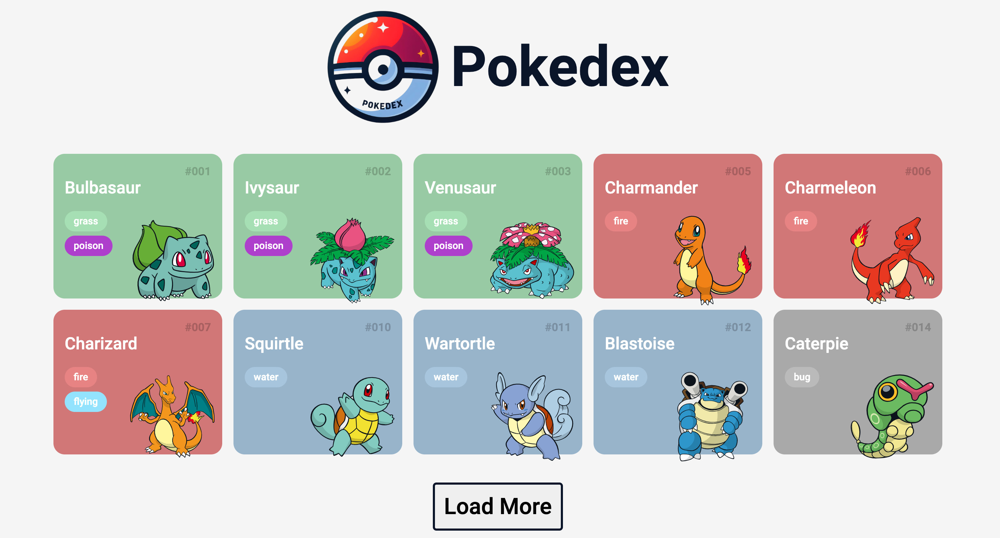

<h1 align="center"> Pokedex </h1>

Desafio do Curso de Desenvolvimento Frontend com Angular.
Explorar o mundo Pokémon através do consumo de uma API REST para a criação de uma Pokédex.

  <a href="#tecnologias">Tecnologias</a>&nbsp;&nbsp;&nbsp;|&nbsp;&nbsp;&nbsp;
  <a href="#layout">Layout</a>&nbsp;&nbsp;&nbsp;|&nbsp;&nbsp;&nbsp;
  <a href="#github-page">GitHub Page</a>

 

  

## Tecnologias

Esse projeto foi desenvolvido com as seguintes tecnologias:

- HTML e CSS
- JavaScript

## Github Page

O projeto também está disponível em uma página do GitHub:

[GiHub Page](https://eneasmarques.github.io/PokeDex)
